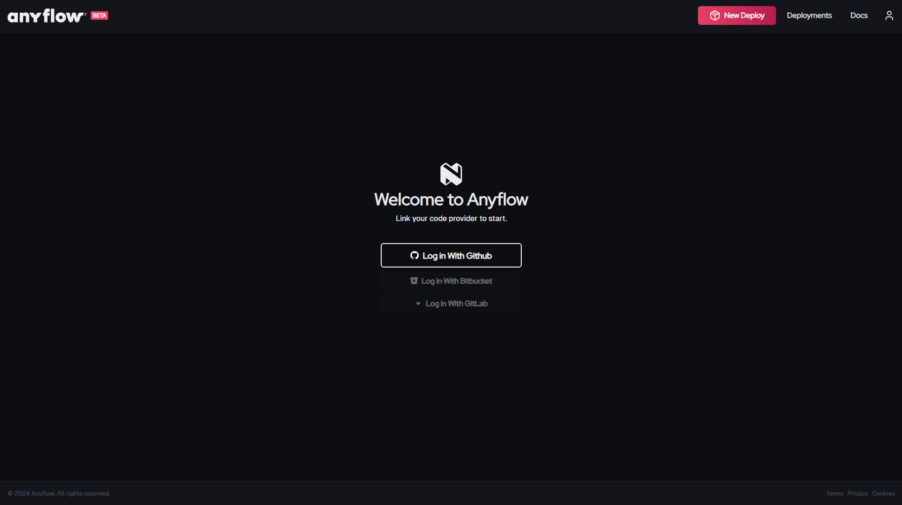

# Getting Started

Welcome to AnyFlow, the platform designed to simplify and automate the deployment of multichain smart contracts. This guide will walk you through the initial steps to get your Hardhat project up and running with AnyFlow **in less than 5 minutes**.

<!-- ## Overview
AnyFlow enables web3 developers to deploy smart contracts across multiple blockchains with ease. Whether you're a solo developer or part of a larger team, AnyFlow provides the tools and workflows to streamline your deployment process. No more RPC configurations, API key management, faucets or chain-specific settings — AnyFlow handles it all for you. -->

## Step 0: Fork our Hello World project

If you do not have a project to deploy, you can fork our Hello World project to get started fast. This Hardhat project contains a simple smart contract that you can deploy to any supported chain to quickly test AnyFlow.

[Fork our Hello World project](https://github.com/AnyFlowLabs/HelloWorld)

## Step 1: Create an AnyFlow Account

Visit the [AnyFlow app](https://app.anyflow.pro/) and authenticate using your Git provider.

## Step 2: Select Your Repository

Next, select the account, repository and branch you wish to deploy from. AnyFlow will then automatically detect your project's configuration and dependencies.

If your Hardhat project is not on the repository's root directory, you can specify the path by checking the "custom root directory" option.

## Step 3: Configure Your Project
Once your repository is connected, configure your deployment:

Select the blockchain networks you wish to deploy to (e.g., Ethereum, Polygon).
Configure any environment variables and deployment settings specific to your project.

If you used environment variables in your deployment scripts, you can set them here. **DO NOT PASTE PRIVATE KEYS HERE**. They're not needed. For more info visit our [How AnyFlow Works](/docs/how_it_works#private_keys) page.

## Step 4: Deploy Your Smart Contracts
With your project configured, you're ready to deploy:

Click "Next" to check all deployment configuration and if everything is correct, click "Deploy".
AnyFlow will automatically handle the deployment process, including funding deployer accounts, retrying if anything fails, and managing API keys.
Monitor the deployment status in real-time, and view the results once complete.

## Next Steps
Congratulations on deploying your first smart contracts with AnyFlow!

<!-- Here’s what you can do next: -->

<!-- - **Explore Advanced Features:** Learn about deterministic addresses, staging environments, multi-step signing, and other advanced features.
- **Integrate with Your Workflow:** Set up CI/CD pipelines with AnyFlow to automate future deployments.
- **Manage Deployments:** Use the AnyFlow dashboard to monitor, redeploy, or roll back your contracts as needed.
- **Try our CLI:** Use the AnyFlow CLI to deploy contracts from your local machine or integrate with your existing scripts. -->

For more details on each step, feel free to explore our documentation.
