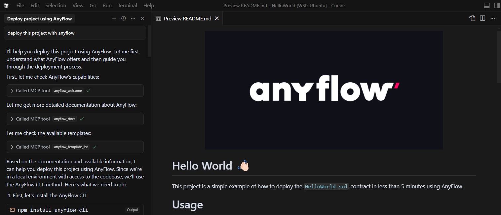

---
---

# Integration Examples

## Deploying a Hardhat project using AnyFlow MCP on Cursor IDE

1. Install AnyFlow MCP on Cursor IDE (see [AnyFlow MCP Installation](./1_install.md))
2. Prompt to deploy:

## Deploying a Template Contract using Claude Desktop

Support for Claude Desktop is coming soon.

## Using ChatGPT to deploy an ERC20 token

Support for ChatGPT is coming soon.
